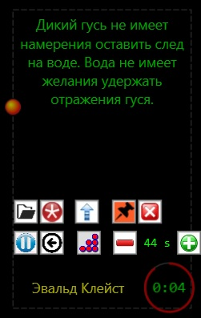
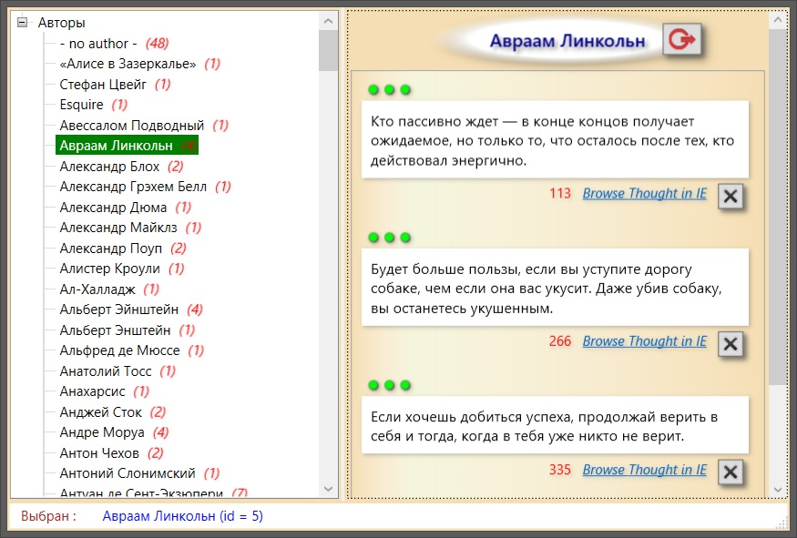
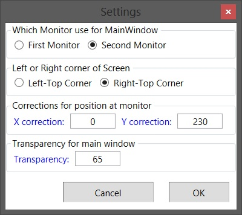
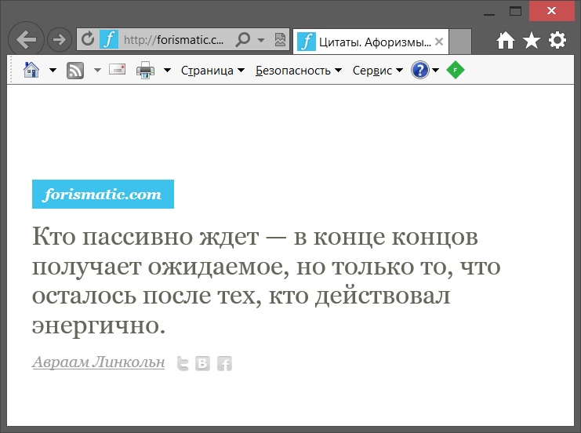

# WPF_Forismatic
Windows Desktop Application made on WPF & C#.

Take a look: 

Code: 
<ul>
	<li><a href="Code/CircularProgress.cs">CircularProgress.cs</a>,</li>
	<li><a href="Code/DoubleToPctConverter.cs">DoubleToPctConverter.cs</a>,</li>
	<li><a href="Code/Forismatic.cs">Forismatic.cs</a>,</li>
	<li><a href="Code/frmSettings.xaml.cs">frmSettings.xaml.cs</a>,</li>
	<li><a href="Code/frmThoughts.xaml.cs">frmThoughts.xaml.cs</a>,</li>
	<li><a href="Code/MainWindow.xaml.cs">MainWindow.xaml.cs</a>,</li>
	<li><a href="Code/ThoughtsRepository.cs">ThoughtsRepository.cs</a>,</li>
	<li><a href="Code/TreeViewLineConverter.cs">TreeViewLineConverter.cs</a>,</li>
	<li><a href="Code/Utils.cs">Utils.cs</a>,</li>
</ul>

XAML:
<ul>
	<li><a href="XAML/frmSettings.xaml">frmSettings.xaml</a>,</li>
	<li><a href="XAML/frmThoughts.xaml">frmThoughts.xaml</a>,</li>
	<li><a href="XAML/MainWindow.xaml">MainWindow.xaml</a>.</li>
</ul>

Here are main, thoughts and setting windows screenshots:
 

 

 

Here is corresponding thought from firismatic site, opened by clicking link at thought window:
 

